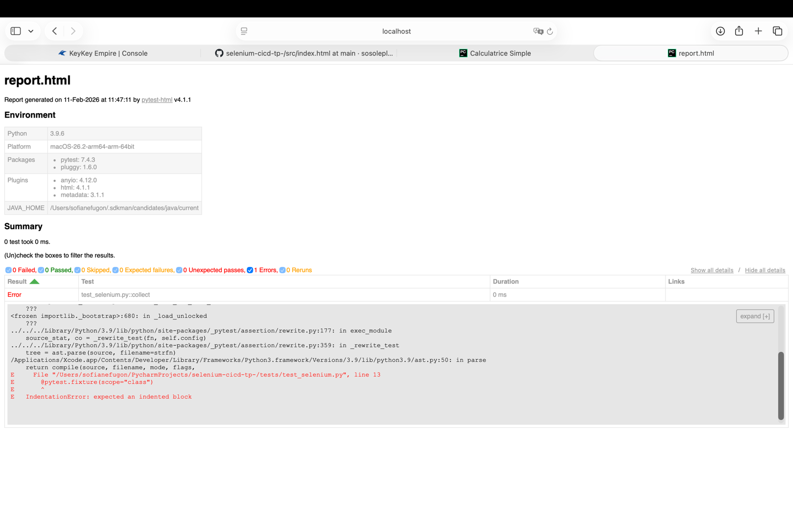

2.3 .
L’erreur IndentationError: expected an indented block 
indique que le fichier Python contient un problème d’indentation : en particulier

File "/Users/sofianefugon/PycharmProjects/selenium-cicd-tp-/tests/test_selenium.py", line 13

